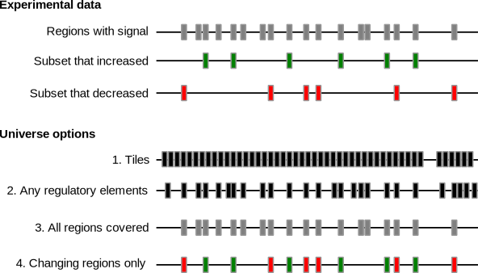

- [What is LOLAweb and what is it used for?](#what)
- [How do I use LOLAweb?](#how-to-use)
- [How do I cite LOLAweb?](#how-to-cite)
- [What universe should I choose?](#uni)
- [What is in the LOLAweb region set databases?](#database)
- [Can I use a custom database with LOLAweb?](#customdb)
- [How do I run LOLAweb locally?](#run-locally)
- [Can I share my LOLAweb results with others?](#share-results)
- [How long are LOLAweb results kept?](#results-kept)
- [What can I find more information or support?](#other-resources)

----------------------------------------

### What is LOLAweb and what is it used for?

LOLAweb is a web server and interactive results viewer for enrichment of overlap
between a query region set (a bed file) and a database of region sets. It
provides an interactive result explorer to visualize the highest ranked
enrichments from the database. LOLAweb is a web interface to the [LOLA R
package](http://bioconductor.org/packages/LOLA/).

LOLA web is useful for exploring enrichment of genomic ranges. Frequently, we uncover sets of genomic regions as relevant for some particular biological scenario. For example, they may be binding sites of a given transcription 

--------------------------------------------------------------------------------

### How do I use LOLAweb?

Using LOLAweb is as easy as 1-2-3. First, all you really need is a bed file
(with at least 3 columns: chromosome, start, and end) identifying regions of
interest. These could be the result of a differential ChIP-seq or ATAC-seq
experiment, or anything, really. Upload that file by dragging it into the first
query box. You'll need to indicate which reference assembly your file subscribes
to.

Second, choose a universe. If you have a set of background regions, upload them
here; otherwise, choose one of our built-in universe sets.

Finally, choose a database. We offer a few options; just start with the default
Core database at first, but feel free to look around. If you want, you can
always use a custom database by running either LOLAweb or LOLA locally.

Hit "Run LOLA" and watch the magic happen! The results will be displayed as an
interactive interface letting you sort and filter the top hits. The schematic
below demonstrates the whole process:

--------------------------------------------------------------------------------

### How do I cite LOLAweb?

LOLAweb is pending publication.

--------------------------------------------------------------------------------

### What universe should I choose?

One of the key questions when you run LOLA is what your background set, or
"universe" is. The universe is a bit open-ended, and it's reasonable to try a
few different things. Changing the universe isn't right or wrong, it just
changes the question you are asking. The universe set is tested for overlap with
the database, and the counts are used in the contingency tables that determine
significance for your user sets. The reason this is important is that if you
have some regions which were never really possible to end up in a region set of
interest, it's unfair to penalize your regions for not overlapping those regions
in the database, changing the results of the significance test.

LOLAweb provides 3 basic options. These options are briefly introduced here, and
then details on how to decide are provided below:

**Use pre-loaded universe**: Here you can select from a series of universes we
have already created for you. These universes vary based on the reference genome
assembly you have chosen. They may include tiling regions (which). LOLAweb
includes a manually curated universe set that was derived by merging all of the
DNAse hypersensitivity data from over 100 cell types from the ENCODE project.

**Build restricted universe**:

**

Let's imagine you've done an experiment where you're testing how some epigenomic
signal (say, H3K27ac or DNA methylation) responds to a perturbation. You end up
with a set of genomic regions that were covered by your assay, along with two
subsets of interest: those that increased, and those that decreased in signal
(see figure).

In this case, one approach is to think of this as two user query sets: one for
each subset of regions that change. Now, what should your universe be? Well, you
have a few options. Let's go through 4 common universe choices see what they
mean about the significance test you're performing. The four choices move in
increasing order of specificity:

<b>Choice 1: genome tiles</b>. LOLAweb lets you choose tiling regions of various
sizes. These tiles are little better than generic splits of the genome because
they at least account for reference assembly gaps. But otherwise, this is a
pretty basic background set which doesn't restrict the question at all. This
would be a useful universe to choose if you are not sure what to expect, and
your experiment could have included any genomic region as output. The result
will tell you what database region sets are enriched in your query sets
generally, across the whole genome.

<b>Choice 2: any regulatory elements</b>. A bit more restricted universe set is
the set of active regulatory elements. LOLAweb includes a manually curated
universe set that was derived by merging all of the DNAse hypersensitivity data
from over 100 cell types from the ENCODE project. This set will restrict your
significance test to only active regulatory elements, so it's a reasonable
background set if you're looking at ChIP-seq data or some other active signal,
but may not be relevant for every experiment type. In practice, we find this to
be a useful first pass test for many experiments. Relative to the tiling
approach, this, for example, won't penalize your overlap test for not
overlapping a database region that's hidden away in a heterochromatic region. It
yields which database region sets are enriched in your query set, but only
considering active parts of the genome. An advantage of this approach is that
it's easy: we've already defined that set for you and you can just select it. A
disadvantage is that you're restricted to elements that were covered in the
considered cell types (although, offsetting that is the point that really
specialized stuff is less likely to be in the database, anyway).

<b>Choice 3: all regions covered</b>. Probably a better choice (though requiring
a bit more work) is to derive the universe from your actual data. The natural
choice would be to use the set of regions your experiment actually covered. You
can think of this universe as the set of regions you tested for possible
inclusion in your user sets; or, in other words, it is the restricted background
set of regions that were tested, including everything in your regions of
interest as well as those that were tested but did not get included. If you can
easily come up with such a test for your problem, this is a really good choice
for background universe. The resulting test will give you overlaps with database
regions without penalizing for areas that weren't even covered in your
experiment anyway. This asks: what's special about my regions that increased,
versus all the regions that didn't?

<b>Choice 4: changing regions only</b> Finally, you could make a very
restrictive universe by just combining your two region sets of interest. In this
case, it would be the set of regions that either increased or decreased. The
result of this test will give you the enrichment of the increased regions
<i>relative to changing regions</i>. This is a subtly different question to ask
than using the set of all covered regions (choice 3). The LOLA R package
provides an easy way to do this with the <i>buildRestrictedUniverse</i>
function, and you can accomplish the same thing with the radio button on
LOLAweb. It assumes that we're only interested in regions that change, then we
ask the question: what's special about the ones that increased?

### How could I define my own universe?

If you want complete control over the question you're asking, the best thing to do is define your own universe. How to do this depends on the particular data you're looking at. Here we outline a few guidelines for common data types to get you started in how to think about the universe:

**DNA methylation data**: all regions that had reasonable coverage of methylation
reads are your universe, and those that were either highly methylated or lowly
methylated (or differentially methylated) would be your subsets of interest.
It's the set of CpGs including all CpGs that had enough reads that they could
have been differentially methylated, even if they weren't. The universe could be
quite different for RRBS (reduced representation bisulfite sequencing) vs. WGBS
(whole-genome bisulfite sequencing).

**Chip-seq data**: 

--------------------------------------------------------------------------------

### What is in the LOLAweb region set databases?

LOLAweb provides access to a few curated databases we have put together for you.
You can also [run LOLAweb on a custom database](#customdb), if you want. But the
online version provides a few useful databases that will suffice for the
majority of users.

When you select a genome assembly, LOLAweb will automatically populate the
database dropdown menu with all available databases for the chosen assembly.
Here are the contents of the databases currently available to LOLAweb users:

**LOLA Core**:

* hg19/hg38
  1. Transcription Factor binding sites from [ENCODE](http://hgdownload.cse.ucsc.edu/goldenPath/hg19/encodeDCC/wgEncodeAwgTfbsUniform/)
  2. Tissue clustered DNase hypersensitive sites from [Sheffield et al. (2013)](http://dnase.genome.duke.edu)
  3. [Codex database](http://codex.stemcells.cam.ac.uk/)
  4. A collection of UCSC feature tables (like CpG islands)
  5. Cistrome database from [Cistrome](http://dx.doi.org/10.1186/gb-2011-12-8-r83)
  6. Epigenome databases from [Cistrome](http://dx.doi.org/10.1186/gb-2011-12-8-r83)
* mm10
  1. [Codex database](http://codex.stemcells.cam.ac.uk/)
  2. Cistrome database
  3. Transcription Factor binding sites from ENCODE
* mm9
  A `liftOver` version of the `mm10` database.

**LOLA Roadmap**:

* hg19/hg38
  All files downloaded from the Roadmap Epigenomics project.

**LOLA Jaspar**:
* hg19/hg38
  We scanned the genome assembly for motif matches to every motif in the JASPAR
  database. Each motif has an entry in the database with all its matches. This
  enables you to do a type of simple motif enrichment analysis to see if your
  regions significantly overlap the set of motif matches for any known motifs.

You can also download these databases and explore them yourself at
http://cloud.databio.org.

--------------------------------------------------------------------------------

### Can I use a custom database with LOLAweb?

Yes, you can, but you'll have to run LOLAweb locally because it's not practical
to let users upload an entire database. Luckily, we've containerized LOLAweb, so
it's relatively easy to run it locally. Alternatively, the [LOLA R
package](http://bioconductor.org/packages/LOLA/) can work with custom databases
and may be simpler, if you don't want to deal with a containerized setup or
running your own local shiny server. But if you do want to run LOLAweb locally,
check out *[how to run LOLAweb locally](#run-locally)*.

--------------------------------------------------------------------------------

### How do I run LOLAweb locally?

You'll need to be familiar with [Docker](http://docker.com). You can find the Docker container for LOLAweb at [Dockerhub (https://hub.docker.com/r/databio/lolaweb/)](https://hub.docker.com/r/databio/lolaweb/). Instructions for run a local LOLAweb instance are here: https://github.com/databio/LOLAweb/tree/master/docker

--------------------------------------------------------------------------------

### Can I share my LOLAweb results with others?
Yes! Once you run your region sets through LOLAweb, you are redirected to a web
page unique to your data. It will look something like this:

<code>http://lolaweb.databio.org/?key=VWQN3ZC5HFD92EK</code>

This link can be sent to other users to share your findings. We do not store
your original data or any identifying information about who submitted it.

--------------------------------------------------------------------------------

### How long are LOLAweb results kept?

LOLAweb results are stored on our servers for one year, then automatically deleted.

### Where can I find more information or support?

Here are

- [LOLAweb Issue tracker](https://github.com/databio/LOLAweb/issues) - please use this for support requests for LOLAweb.
- [LOLAweb GitHub source code](https://github.com/databio/LOLAweb)
- [Dockerhub docker image](https://hub.docker.com/r/databio/lolaweb/)
- Manuscript (pending)
- [LOLA R package at Bioconductor](http://bioconductor.org/packages/LOLA/)
- [LOLA R package source code at GitHub](https://github.com/nsheff/LOLA)
- [LOLA R package documentation](http://code.databio.org/LOLA)
- [Published Bioinformatics paper describing LOLA](http://dx.doi.org/10.1093/bioinformatics/btv612)
- [Region set databases and vignette data](http://cloud.databio.org)

